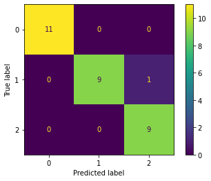
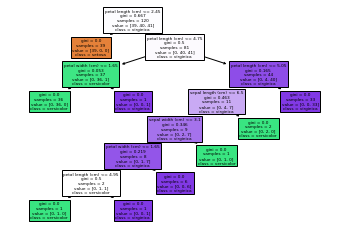
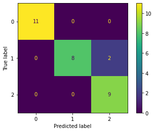
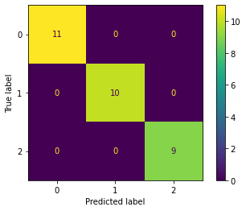
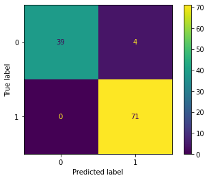
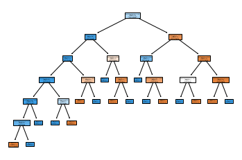
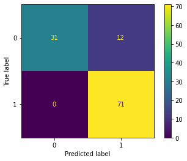
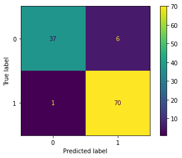
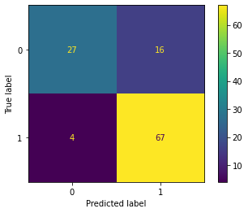
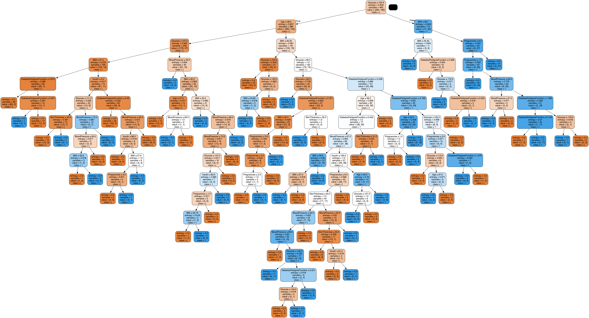

```python
import pandas as pd
import numpy as np
import matplotlib.pyplot as plt
from IPython.display import display, HTML
from sklearn.naive_bayes import BernoulliNB, MultinomialNB, GaussianNB
from sklearn.tree import DecisionTreeClassifier, plot_tree
from sklearn.model_selection import train_test_split
from sklearn.preprocessing import StandardScaler
from sklearn.metrics import accuracy_score, classification_report, confusion_matrix, ConfusionMatrixDisplay
```


```python
from sklearn.datasets import load_iris, load_breast_cancer
iris_dataset=load_iris()
breast_cancer_dataset=load_breast_cancer()
```

# **IRIS DATASET**


```python
df_iris=pd.DataFrame(iris_dataset.data,columns=iris_dataset.feature_names)
display(df_iris)
df_iris_target=iris_dataset.target
display(df_iris_target)
```


<div>
<style scoped>
    .dataframe tbody tr th:only-of-type {
        vertical-align: middle;
    }

    .dataframe tbody tr th {
        vertical-align: top;
    }

    .dataframe thead th {
        text-align: right;
    }
</style>
<table border="1" class="dataframe">
  <thead>
    <tr style="text-align: right;">
      <th></th>
      <th>sepal length (cm)</th>
      <th>sepal width (cm)</th>
      <th>petal length (cm)</th>
      <th>petal width (cm)</th>
    </tr>
  </thead>
  <tbody>
    <tr>
      <th>0</th>
      <td>5.1</td>
      <td>3.5</td>
      <td>1.4</td>
      <td>0.2</td>
    </tr>
    <tr>
      <th>1</th>
      <td>4.9</td>
      <td>3.0</td>
      <td>1.4</td>
      <td>0.2</td>
    </tr>
    <tr>
      <th>2</th>
      <td>4.7</td>
      <td>3.2</td>
      <td>1.3</td>
      <td>0.2</td>
    </tr>
    <tr>
      <th>3</th>
      <td>4.6</td>
      <td>3.1</td>
      <td>1.5</td>
      <td>0.2</td>
    </tr>
    <tr>
      <th>4</th>
      <td>5.0</td>
      <td>3.6</td>
      <td>1.4</td>
      <td>0.2</td>
    </tr>
    <tr>
      <th>...</th>
      <td>...</td>
      <td>...</td>
      <td>...</td>
      <td>...</td>
    </tr>
    <tr>
      <th>145</th>
      <td>6.7</td>
      <td>3.0</td>
      <td>5.2</td>
      <td>2.3</td>
    </tr>
    <tr>
      <th>146</th>
      <td>6.3</td>
      <td>2.5</td>
      <td>5.0</td>
      <td>1.9</td>
    </tr>
    <tr>
      <th>147</th>
      <td>6.5</td>
      <td>3.0</td>
      <td>5.2</td>
      <td>2.0</td>
    </tr>
    <tr>
      <th>148</th>
      <td>6.2</td>
      <td>3.4</td>
      <td>5.4</td>
      <td>2.3</td>
    </tr>
    <tr>
      <th>149</th>
      <td>5.9</td>
      <td>3.0</td>
      <td>5.1</td>
      <td>1.8</td>
    </tr>
  </tbody>
</table>
<p>150 rows × 4 columns</p>
</div>


    array([0, 0, 0, 0, 0, 0, 0, 0, 0, 0, 0, 0, 0, 0, 0, 0, 0, 0, 0, 0, 0, 0,
           0, 0, 0, 0, 0, 0, 0, 0, 0, 0, 0, 0, 0, 0, 0, 0, 0, 0, 0, 0, 0, 0,
           0, 0, 0, 0, 0, 0, 1, 1, 1, 1, 1, 1, 1, 1, 1, 1, 1, 1, 1, 1, 1, 1,
           1, 1, 1, 1, 1, 1, 1, 1, 1, 1, 1, 1, 1, 1, 1, 1, 1, 1, 1, 1, 1, 1,
           1, 1, 1, 1, 1, 1, 1, 1, 1, 1, 1, 1, 2, 2, 2, 2, 2, 2, 2, 2, 2, 2,
           2, 2, 2, 2, 2, 2, 2, 2, 2, 2, 2, 2, 2, 2, 2, 2, 2, 2, 2, 2, 2, 2,
           2, 2, 2, 2, 2, 2, 2, 2, 2, 2, 2, 2, 2, 2, 2, 2, 2, 2])


```python
X_train,X_test,Y_train,Y_test=train_test_split(df_iris,df_iris_target,test_size=0.20)
```


```python
dt_classifier=DecisionTreeClassifier()
dt_classifier.fit(X_train,Y_train)
Y_pred=dt_classifier.predict(X_test)
```


```python
dt_cm=confusion_matrix(Y_test,Y_pred)
print("Confusion Matrix:")
print(dt_cm)
print("=========================================")
print("=========================================")
print("Performance Evaluation:")
print(classification_report(Y_test,Y_pred))
```

    Confusion Matrix:
    [[11  0  0]
     [ 0  9  1]
     [ 0  0  9]]
    =========================================
    =========================================
    Performance Evaluation:
                  precision    recall  f1-score   support
    
               0       1.00      1.00      1.00        11
               1       1.00      0.90      0.95        10
               2       0.90      1.00      0.95         9
    
        accuracy                           0.97        30
       macro avg       0.97      0.97      0.96        30
    weighted avg       0.97      0.97      0.97        30
    


```python
(ConfusionMatrixDisplay(confusion_matrix=dt_cm).plot())
```


    <sklearn.metrics._plot.confusion_matrix.ConfusionMatrixDisplay at 0x7fbcf3cc45b0>


    

    


```python
from sklearn.tree import plot_tree
plot_tree(dt_classifier,feature_names=iris_dataset.feature_names,class_names=iris_dataset.target_names,filled=True)
```


    [Text(0.375, 0.9375, 'petal length (cm) <= 2.45\ngini = 0.667\nsamples = 120\nvalue = [39, 40, 41]\nclass = virginica'),
     Text(0.25, 0.8125, 'gini = 0.0\nsamples = 39\nvalue = [39, 0, 0]\nclass = setosa'),
     Text(0.5, 0.8125, 'petal length (cm) <= 4.75\ngini = 0.5\nsamples = 81\nvalue = [0, 40, 41]\nclass = virginica'),
     Text(0.25, 0.6875, 'petal width (cm) <= 1.65\ngini = 0.053\nsamples = 37\nvalue = [0, 36, 1]\nclass = versicolor'),
     Text(0.125, 0.5625, 'gini = 0.0\nsamples = 36\nvalue = [0, 36, 0]\nclass = versicolor'),
     Text(0.375, 0.5625, 'gini = 0.0\nsamples = 1\nvalue = [0, 0, 1]\nclass = virginica'),
     Text(0.75, 0.6875, 'petal length (cm) <= 5.05\ngini = 0.165\nsamples = 44\nvalue = [0, 4, 40]\nclass = virginica'),
     Text(0.625, 0.5625, 'sepal length (cm) <= 6.5\ngini = 0.463\nsamples = 11\nvalue = [0, 4, 7]\nclass = virginica'),
     Text(0.5, 0.4375, 'sepal width (cm) <= 3.1\ngini = 0.346\nsamples = 9\nvalue = [0, 2, 7]\nclass = virginica'),
     Text(0.375, 0.3125, 'petal width (cm) <= 1.65\ngini = 0.219\nsamples = 8\nvalue = [0, 1, 7]\nclass = virginica'),
     Text(0.25, 0.1875, 'petal length (cm) <= 4.95\ngini = 0.5\nsamples = 2\nvalue = [0, 1, 1]\nclass = versicolor'),
     Text(0.125, 0.0625, 'gini = 0.0\nsamples = 1\nvalue = [0, 1, 0]\nclass = versicolor'),
     Text(0.375, 0.0625, 'gini = 0.0\nsamples = 1\nvalue = [0, 0, 1]\nclass = virginica'),
     Text(0.5, 0.1875, 'gini = 0.0\nsamples = 6\nvalue = [0, 0, 6]\nclass = virginica'),
     Text(0.625, 0.3125, 'gini = 0.0\nsamples = 1\nvalue = [0, 1, 0]\nclass = versicolor'),
     Text(0.75, 0.4375, 'gini = 0.0\nsamples = 2\nvalue = [0, 2, 0]\nclass = versicolor'),
     Text(0.875, 0.5625, 'gini = 0.0\nsamples = 33\nvalue = [0, 0, 33]\nclass = virginica')]


    

    


```python
mnb_classifier=MultinomialNB().fit(X_train,Y_train)
mnb_classifier.fit(X_train,Y_train)
Y_pred=mnb_classifier.predict(X_test)
```


```python
mnb_cm=confusion_matrix(Y_test,Y_pred)
print("Confusion Matrix:")
print(mnb_cm)
print("=========================================")
print("=========================================")
print("Performance Evaluation:")
print(classification_report(Y_test,Y_pred))
```

    Confusion Matrix:
    [[11  0  0]
     [ 0  8  2]
     [ 0  0  9]]
    =========================================
    =========================================
    Performance Evaluation:
                  precision    recall  f1-score   support
    
               0       1.00      1.00      1.00        11
               1       1.00      0.80      0.89        10
               2       0.82      1.00      0.90         9
    
        accuracy                           0.93        30
       macro avg       0.94      0.93      0.93        30
    weighted avg       0.95      0.93      0.93        30
    


```python
(ConfusionMatrixDisplay(confusion_matrix=mnb_cm).plot())
```


    <sklearn.metrics._plot.confusion_matrix.ConfusionMatrixDisplay at 0x7fbd0162ea30>


    

    


```python
gnb_classifier=GaussianNB().fit(X_train,Y_train)
gnb_classifier.fit(X_train,Y_train)
Y_pred=gnb_classifier.predict(X_test)
```


```python
gnb_cm=confusion_matrix(Y_test,Y_pred)
print("Confusion Matrix:")
print(gnb_cm)
print("=========================================")
print("=========================================")
print("Performance Evaluation:")
print(classification_report(Y_test,Y_pred))
```

    Confusion Matrix:
    [[11  0  0]
     [ 0  9  1]
     [ 0  0  9]]
    =========================================
    =========================================
    Performance Evaluation:
                  precision    recall  f1-score   support
    
               0       1.00      1.00      1.00        11
               1       1.00      0.90      0.95        10
               2       0.90      1.00      0.95         9
    
        accuracy                           0.97        30
       macro avg       0.97      0.97      0.96        30
    weighted avg       0.97      0.97      0.97        30
    


```python
(ConfusionMatrixDisplay(confusion_matrix=gnb_cm).plot())
```


    <sklearn.metrics._plot.confusion_matrix.ConfusionMatrixDisplay at 0x7fbcf3e09760>


    

    


```python
bnb_classifier=BernoulliNB(alpha=1.1, binarize=1.7).fit(X_train,Y_train)
bnb_classifier.fit(X_train,Y_train)
Y_pred=bnb_classifier.predict(X_test)
```


```python
bnb_cm=confusion_matrix(Y_test,Y_pred)
print("Confusion Matrix:")
print(bnb_cm)
print("=========================================")
print("=========================================")
print("Performance Evaluation:")
print(classification_report(Y_test,Y_pred))
```

    Confusion Matrix:
    [[11  0  0]
     [ 0 10  0]
     [ 0  0  9]]
    =========================================
    =========================================
    Performance Evaluation:
                  precision    recall  f1-score   support
    
               0       1.00      1.00      1.00        11
               1       1.00      1.00      1.00        10
               2       1.00      1.00      1.00         9
    
        accuracy                           1.00        30
       macro avg       1.00      1.00      1.00        30
    weighted avg       1.00      1.00      1.00        30
    


```python
(ConfusionMatrixDisplay(confusion_matrix=bnb_cm).plot())
```


    <sklearn.metrics._plot.confusion_matrix.ConfusionMatrixDisplay at 0x7fbcf3e7fc40>


    

    


# **BREAST CANCER DATASET**


```python
df_cancer=pd.DataFrame(breast_cancer_dataset.data,columns=breast_cancer_dataset.feature_names)
display(df_cancer)
df_cancer_target=breast_cancer_dataset.target
display(df_cancer_target)
```


<div>
<style scoped>
    .dataframe tbody tr th:only-of-type {
        vertical-align: middle;
    }

    .dataframe tbody tr th {
        vertical-align: top;
    }

    .dataframe thead th {
        text-align: right;
    }
</style>
<table border="1" class="dataframe">
  <thead>
    <tr style="text-align: right;">
      <th></th>
      <th>mean radius</th>
      <th>mean texture</th>
      <th>mean perimeter</th>
      <th>mean area</th>
      <th>mean smoothness</th>
      <th>mean compactness</th>
      <th>mean concavity</th>
      <th>mean concave points</th>
      <th>mean symmetry</th>
      <th>mean fractal dimension</th>
      <th>...</th>
      <th>worst radius</th>
      <th>worst texture</th>
      <th>worst perimeter</th>
      <th>worst area</th>
      <th>worst smoothness</th>
      <th>worst compactness</th>
      <th>worst concavity</th>
      <th>worst concave points</th>
      <th>worst symmetry</th>
      <th>worst fractal dimension</th>
    </tr>
  </thead>
  <tbody>
    <tr>
      <th>0</th>
      <td>17.99</td>
      <td>10.38</td>
      <td>122.80</td>
      <td>1001.0</td>
      <td>0.11840</td>
      <td>0.27760</td>
      <td>0.30010</td>
      <td>0.14710</td>
      <td>0.2419</td>
      <td>0.07871</td>
      <td>...</td>
      <td>25.380</td>
      <td>17.33</td>
      <td>184.60</td>
      <td>2019.0</td>
      <td>0.16220</td>
      <td>0.66560</td>
      <td>0.7119</td>
      <td>0.2654</td>
      <td>0.4601</td>
      <td>0.11890</td>
    </tr>
    <tr>
      <th>1</th>
      <td>20.57</td>
      <td>17.77</td>
      <td>132.90</td>
      <td>1326.0</td>
      <td>0.08474</td>
      <td>0.07864</td>
      <td>0.08690</td>
      <td>0.07017</td>
      <td>0.1812</td>
      <td>0.05667</td>
      <td>...</td>
      <td>24.990</td>
      <td>23.41</td>
      <td>158.80</td>
      <td>1956.0</td>
      <td>0.12380</td>
      <td>0.18660</td>
      <td>0.2416</td>
      <td>0.1860</td>
      <td>0.2750</td>
      <td>0.08902</td>
    </tr>
    <tr>
      <th>2</th>
      <td>19.69</td>
      <td>21.25</td>
      <td>130.00</td>
      <td>1203.0</td>
      <td>0.10960</td>
      <td>0.15990</td>
      <td>0.19740</td>
      <td>0.12790</td>
      <td>0.2069</td>
      <td>0.05999</td>
      <td>...</td>
      <td>23.570</td>
      <td>25.53</td>
      <td>152.50</td>
      <td>1709.0</td>
      <td>0.14440</td>
      <td>0.42450</td>
      <td>0.4504</td>
      <td>0.2430</td>
      <td>0.3613</td>
      <td>0.08758</td>
    </tr>
    <tr>
      <th>3</th>
      <td>11.42</td>
      <td>20.38</td>
      <td>77.58</td>
      <td>386.1</td>
      <td>0.14250</td>
      <td>0.28390</td>
      <td>0.24140</td>
      <td>0.10520</td>
      <td>0.2597</td>
      <td>0.09744</td>
      <td>...</td>
      <td>14.910</td>
      <td>26.50</td>
      <td>98.87</td>
      <td>567.7</td>
      <td>0.20980</td>
      <td>0.86630</td>
      <td>0.6869</td>
      <td>0.2575</td>
      <td>0.6638</td>
      <td>0.17300</td>
    </tr>
    <tr>
      <th>4</th>
      <td>20.29</td>
      <td>14.34</td>
      <td>135.10</td>
      <td>1297.0</td>
      <td>0.10030</td>
      <td>0.13280</td>
      <td>0.19800</td>
      <td>0.10430</td>
      <td>0.1809</td>
      <td>0.05883</td>
      <td>...</td>
      <td>22.540</td>
      <td>16.67</td>
      <td>152.20</td>
      <td>1575.0</td>
      <td>0.13740</td>
      <td>0.20500</td>
      <td>0.4000</td>
      <td>0.1625</td>
      <td>0.2364</td>
      <td>0.07678</td>
    </tr>
    <tr>
      <th>...</th>
      <td>...</td>
      <td>...</td>
      <td>...</td>
      <td>...</td>
      <td>...</td>
      <td>...</td>
      <td>...</td>
      <td>...</td>
      <td>...</td>
      <td>...</td>
      <td>...</td>
      <td>...</td>
      <td>...</td>
      <td>...</td>
      <td>...</td>
      <td>...</td>
      <td>...</td>
      <td>...</td>
      <td>...</td>
      <td>...</td>
      <td>...</td>
    </tr>
    <tr>
      <th>564</th>
      <td>21.56</td>
      <td>22.39</td>
      <td>142.00</td>
      <td>1479.0</td>
      <td>0.11100</td>
      <td>0.11590</td>
      <td>0.24390</td>
      <td>0.13890</td>
      <td>0.1726</td>
      <td>0.05623</td>
      <td>...</td>
      <td>25.450</td>
      <td>26.40</td>
      <td>166.10</td>
      <td>2027.0</td>
      <td>0.14100</td>
      <td>0.21130</td>
      <td>0.4107</td>
      <td>0.2216</td>
      <td>0.2060</td>
      <td>0.07115</td>
    </tr>
    <tr>
      <th>565</th>
      <td>20.13</td>
      <td>28.25</td>
      <td>131.20</td>
      <td>1261.0</td>
      <td>0.09780</td>
      <td>0.10340</td>
      <td>0.14400</td>
      <td>0.09791</td>
      <td>0.1752</td>
      <td>0.05533</td>
      <td>...</td>
      <td>23.690</td>
      <td>38.25</td>
      <td>155.00</td>
      <td>1731.0</td>
      <td>0.11660</td>
      <td>0.19220</td>
      <td>0.3215</td>
      <td>0.1628</td>
      <td>0.2572</td>
      <td>0.06637</td>
    </tr>
    <tr>
      <th>566</th>
      <td>16.60</td>
      <td>28.08</td>
      <td>108.30</td>
      <td>858.1</td>
      <td>0.08455</td>
      <td>0.10230</td>
      <td>0.09251</td>
      <td>0.05302</td>
      <td>0.1590</td>
      <td>0.05648</td>
      <td>...</td>
      <td>18.980</td>
      <td>34.12</td>
      <td>126.70</td>
      <td>1124.0</td>
      <td>0.11390</td>
      <td>0.30940</td>
      <td>0.3403</td>
      <td>0.1418</td>
      <td>0.2218</td>
      <td>0.07820</td>
    </tr>
    <tr>
      <th>567</th>
      <td>20.60</td>
      <td>29.33</td>
      <td>140.10</td>
      <td>1265.0</td>
      <td>0.11780</td>
      <td>0.27700</td>
      <td>0.35140</td>
      <td>0.15200</td>
      <td>0.2397</td>
      <td>0.07016</td>
      <td>...</td>
      <td>25.740</td>
      <td>39.42</td>
      <td>184.60</td>
      <td>1821.0</td>
      <td>0.16500</td>
      <td>0.86810</td>
      <td>0.9387</td>
      <td>0.2650</td>
      <td>0.4087</td>
      <td>0.12400</td>
    </tr>
    <tr>
      <th>568</th>
      <td>7.76</td>
      <td>24.54</td>
      <td>47.92</td>
      <td>181.0</td>
      <td>0.05263</td>
      <td>0.04362</td>
      <td>0.00000</td>
      <td>0.00000</td>
      <td>0.1587</td>
      <td>0.05884</td>
      <td>...</td>
      <td>9.456</td>
      <td>30.37</td>
      <td>59.16</td>
      <td>268.6</td>
      <td>0.08996</td>
      <td>0.06444</td>
      <td>0.0000</td>
      <td>0.0000</td>
      <td>0.2871</td>
      <td>0.07039</td>
    </tr>
  </tbody>
</table>
<p>569 rows × 30 columns</p>
</div>


    array([0, 0, 0, 0, 0, 0, 0, 0, 0, 0, 0, 0, 0, 0, 0, 0, 0, 0, 0, 1, 1, 1,
           0, 0, 0, 0, 0, 0, 0, 0, 0, 0, 0, 0, 0, 0, 0, 1, 0, 0, 0, 0, 0, 0,
           0, 0, 1, 0, 1, 1, 1, 1, 1, 0, 0, 1, 0, 0, 1, 1, 1, 1, 0, 1, 0, 0,
           1, 1, 1, 1, 0, 1, 0, 0, 1, 0, 1, 0, 0, 1, 1, 1, 0, 0, 1, 0, 0, 0,
           1, 1, 1, 0, 1, 1, 0, 0, 1, 1, 1, 0, 0, 1, 1, 1, 1, 0, 1, 1, 0, 1,
           1, 1, 1, 1, 1, 1, 1, 0, 0, 0, 1, 0, 0, 1, 1, 1, 0, 0, 1, 0, 1, 0,
           0, 1, 0, 0, 1, 1, 0, 1, 1, 0, 1, 1, 1, 1, 0, 1, 1, 1, 1, 1, 1, 1,
           1, 1, 0, 1, 1, 1, 1, 0, 0, 1, 0, 1, 1, 0, 0, 1, 1, 0, 0, 1, 1, 1,
           1, 0, 1, 1, 0, 0, 0, 1, 0, 1, 0, 1, 1, 1, 0, 1, 1, 0, 0, 1, 0, 0,
           0, 0, 1, 0, 0, 0, 1, 0, 1, 0, 1, 1, 0, 1, 0, 0, 0, 0, 1, 1, 0, 0,
           1, 1, 1, 0, 1, 1, 1, 1, 1, 0, 0, 1, 1, 0, 1, 1, 0, 0, 1, 0, 1, 1,
           1, 1, 0, 1, 1, 1, 1, 1, 0, 1, 0, 0, 0, 0, 0, 0, 0, 0, 0, 0, 0, 0,
           0, 0, 1, 1, 1, 1, 1, 1, 0, 1, 0, 1, 1, 0, 1, 1, 0, 1, 0, 0, 1, 1,
           1, 1, 1, 1, 1, 1, 1, 1, 1, 1, 1, 0, 1, 1, 0, 1, 0, 1, 1, 1, 1, 1,
           1, 1, 1, 1, 1, 1, 1, 1, 1, 0, 1, 1, 1, 0, 1, 0, 1, 1, 1, 1, 0, 0,
           0, 1, 1, 1, 1, 0, 1, 0, 1, 0, 1, 1, 1, 0, 1, 1, 1, 1, 1, 1, 1, 0,
           0, 0, 1, 1, 1, 1, 1, 1, 1, 1, 1, 1, 1, 0, 0, 1, 0, 0, 0, 1, 0, 0,
           1, 1, 1, 1, 1, 0, 1, 1, 1, 1, 1, 0, 1, 1, 1, 0, 1, 1, 0, 0, 1, 1,
           1, 1, 1, 1, 0, 1, 1, 1, 1, 1, 1, 1, 0, 1, 1, 1, 1, 1, 0, 1, 1, 0,
           1, 1, 1, 1, 1, 1, 1, 1, 1, 1, 1, 1, 0, 1, 0, 0, 1, 0, 1, 1, 1, 1,
           1, 0, 1, 1, 0, 1, 0, 1, 1, 0, 1, 0, 1, 1, 1, 1, 1, 1, 1, 1, 0, 0,
           1, 1, 1, 1, 1, 1, 0, 1, 1, 1, 1, 1, 1, 1, 1, 1, 1, 0, 1, 1, 1, 1,
           1, 1, 1, 0, 1, 0, 1, 1, 0, 1, 1, 1, 1, 1, 0, 0, 1, 0, 1, 0, 1, 1,
           1, 1, 1, 0, 1, 1, 0, 1, 0, 1, 0, 0, 1, 1, 1, 0, 1, 1, 1, 1, 1, 1,
           1, 1, 1, 1, 1, 0, 1, 0, 0, 1, 1, 1, 1, 1, 1, 1, 1, 1, 1, 1, 1, 1,
           1, 1, 1, 1, 1, 1, 1, 1, 1, 1, 1, 1, 0, 0, 0, 0, 0, 0, 1])


```python
X_train,X_test,Y_train,Y_test=train_test_split(df_cancer,df_cancer_target,test_size=0.20)
```


```python
dt_classifier=DecisionTreeClassifier()
dt_classifier.fit(X_train,Y_train)
Y_pred=dt_classifier.predict(X_test)
```


```python
dt_cm=confusion_matrix(Y_test,Y_pred)
print("Confusion Matrix:")
print(dt_cm)
print("=========================================")
print("=========================================")
print("Performance Evaluation:")
print(classification_report(Y_test,Y_pred))
```

    Confusion Matrix:
    [[39  4]
     [ 0 71]]
    =========================================
    =========================================
    Performance Evaluation:
                  precision    recall  f1-score   support
    
               0       1.00      0.91      0.95        43
               1       0.95      1.00      0.97        71
    
        accuracy                           0.96       114
       macro avg       0.97      0.95      0.96       114
    weighted avg       0.97      0.96      0.96       114
    


```python
(ConfusionMatrixDisplay(confusion_matrix=dt_cm).plot())
```


    <sklearn.metrics._plot.confusion_matrix.ConfusionMatrixDisplay at 0x7fbd017e1970>


    

    


```python
plot_tree(dt_classifier,feature_names=breast_cancer_dataset.feature_names,class_names=breast_cancer_dataset.target_names,filled=True)
```


    [Text(0.5491071428571429, 0.9285714285714286, 'mean concave points <= 0.052\ngini = 0.467\nsamples = 455\nvalue = [169, 286]\nclass = benign'),
     Text(0.36607142857142855, 0.7857142857142857, 'worst radius <= 16.83\ngini = 0.095\nsamples = 279\nvalue = [14, 265]\nclass = benign'),
     Text(0.26785714285714285, 0.6428571428571429, 'area error <= 48.7\ngini = 0.037\nsamples = 263\nvalue = [5, 258]\nclass = benign'),
     Text(0.17857142857142858, 0.5, 'mean concave points <= 0.049\ngini = 0.023\nsamples = 260\nvalue = [3, 257]\nclass = benign'),
     Text(0.10714285714285714, 0.35714285714285715, 'smoothness error <= 0.003\ngini = 0.008\nsamples = 255\nvalue = [1, 254]\nclass = benign'),
     Text(0.07142857142857142, 0.21428571428571427, 'fractal dimension error <= 0.001\ngini = 0.278\nsamples = 6\nvalue = [1, 5]\nclass = benign'),
     Text(0.03571428571428571, 0.07142857142857142, 'gini = 0.0\nsamples = 1\nvalue = [1, 0]\nclass = malignant'),
     Text(0.10714285714285714, 0.07142857142857142, 'gini = 0.0\nsamples = 5\nvalue = [0, 5]\nclass = benign'),
     Text(0.14285714285714285, 0.21428571428571427, 'gini = 0.0\nsamples = 249\nvalue = [0, 249]\nclass = benign'),
     Text(0.25, 0.35714285714285715, 'worst area <= 796.25\ngini = 0.48\nsamples = 5\nvalue = [2, 3]\nclass = benign'),
     Text(0.21428571428571427, 0.21428571428571427, 'gini = 0.0\nsamples = 3\nvalue = [0, 3]\nclass = benign'),
     Text(0.2857142857142857, 0.21428571428571427, 'gini = 0.0\nsamples = 2\nvalue = [2, 0]\nclass = malignant'),
     Text(0.35714285714285715, 0.5, 'mean concavity <= 0.029\ngini = 0.444\nsamples = 3\nvalue = [2, 1]\nclass = malignant'),
     Text(0.32142857142857145, 0.35714285714285715, 'gini = 0.0\nsamples = 2\nvalue = [2, 0]\nclass = malignant'),
     Text(0.39285714285714285, 0.35714285714285715, 'gini = 0.0\nsamples = 1\nvalue = [0, 1]\nclass = benign'),
     Text(0.4642857142857143, 0.6428571428571429, 'mean texture <= 18.68\ngini = 0.492\nsamples = 16\nvalue = [9, 7]\nclass = malignant'),
     Text(0.42857142857142855, 0.5, 'gini = 0.0\nsamples = 6\nvalue = [0, 6]\nclass = benign'),
     Text(0.5, 0.5, 'concavity error <= 0.03\ngini = 0.18\nsamples = 10\nvalue = [9, 1]\nclass = malignant'),
     Text(0.4642857142857143, 0.35714285714285715, 'gini = 0.0\nsamples = 9\nvalue = [9, 0]\nclass = malignant'),
     Text(0.5357142857142857, 0.35714285714285715, 'gini = 0.0\nsamples = 1\nvalue = [0, 1]\nclass = benign'),
     Text(0.7321428571428571, 0.7857142857142857, 'worst perimeter <= 101.95\ngini = 0.21\nsamples = 176\nvalue = [155, 21]\nclass = malignant'),
     Text(0.6071428571428571, 0.6428571428571429, 'worst texture <= 25.89\ngini = 0.36\nsamples = 17\nvalue = [4, 13]\nclass = benign'),
     Text(0.5714285714285714, 0.5, 'gini = 0.0\nsamples = 12\nvalue = [0, 12]\nclass = benign'),
     Text(0.6428571428571429, 0.5, 'worst fractal dimension <= 0.086\ngini = 0.32\nsamples = 5\nvalue = [4, 1]\nclass = malignant'),
     Text(0.6071428571428571, 0.35714285714285715, 'gini = 0.0\nsamples = 1\nvalue = [0, 1]\nclass = benign'),
     Text(0.6785714285714286, 0.35714285714285715, 'gini = 0.0\nsamples = 4\nvalue = [4, 0]\nclass = malignant'),
     Text(0.8571428571428571, 0.6428571428571429, 'worst texture <= 20.875\ngini = 0.096\nsamples = 159\nvalue = [151, 8]\nclass = malignant'),
     Text(0.7857142857142857, 0.5, 'mean concave points <= 0.091\ngini = 0.5\nsamples = 14\nvalue = [7, 7]\nclass = malignant'),
     Text(0.75, 0.35714285714285715, 'gini = 0.0\nsamples = 7\nvalue = [0, 7]\nclass = benign'),
     Text(0.8214285714285714, 0.35714285714285715, 'gini = 0.0\nsamples = 7\nvalue = [7, 0]\nclass = malignant'),
     Text(0.9285714285714286, 0.5, 'fractal dimension error <= 0.013\ngini = 0.014\nsamples = 145\nvalue = [144, 1]\nclass = malignant'),
     Text(0.8928571428571429, 0.35714285714285715, 'gini = 0.0\nsamples = 144\nvalue = [144, 0]\nclass = malignant'),
     Text(0.9642857142857143, 0.35714285714285715, 'gini = 0.0\nsamples = 1\nvalue = [0, 1]\nclass = benign')]


    

    


```python
mnb_classifier=MultinomialNB(alpha=1.1).fit(X_train,Y_train)
mnb_classifier.fit(X_train,Y_train)
Y_pred=mnb_classifier.predict(X_test)
```


```python
mnb_cm=confusion_matrix(Y_test,Y_pred)
print("Confusion Matrix:")
print(mnb_cm)
print("=========================================")
print("=========================================")
print("Performance Evaluation:")
print(classification_report(Y_test,Y_pred))
```

    Confusion Matrix:
    [[31 12]
     [ 0 71]]
    =========================================
    =========================================
    Performance Evaluation:
                  precision    recall  f1-score   support
    
               0       1.00      0.72      0.84        43
               1       0.86      1.00      0.92        71
    
        accuracy                           0.89       114
       macro avg       0.93      0.86      0.88       114
    weighted avg       0.91      0.89      0.89       114
    


```python
(ConfusionMatrixDisplay(confusion_matrix=mnb_cm).plot())
```


    <sklearn.metrics._plot.confusion_matrix.ConfusionMatrixDisplay at 0x7fbcf3f9a580>


    

    


```python
gnb_classifier=GaussianNB().fit(X_train,Y_train)
gnb_classifier.fit(X_train,Y_train)
Y_pred=gnb_classifier.predict(X_test)
```


```python
gnb_cm=confusion_matrix(Y_test,Y_pred)
print("Confusion Matrix:")
print(gnb_cm)
print("=========================================")
print("=========================================")
print("Performance Evaluation:")
print(classification_report(Y_test,Y_pred))
```

    Confusion Matrix:
    [[37  6]
     [ 1 70]]
    =========================================
    =========================================
    Performance Evaluation:
                  precision    recall  f1-score   support
    
               0       0.97      0.86      0.91        43
               1       0.92      0.99      0.95        71
    
        accuracy                           0.94       114
       macro avg       0.95      0.92      0.93       114
    weighted avg       0.94      0.94      0.94       114
    


```python
(ConfusionMatrixDisplay(confusion_matrix=gnb_cm).plot())
```


    <sklearn.metrics._plot.confusion_matrix.ConfusionMatrixDisplay at 0x7fbd014e2df0>


    

    


```python
bnb_cm=BernoulliNB(alpha=1.1, binarize=2.9).fit(X_train,Y_train)
bnb_cm.fit(X_train,Y_train)
Y_pred=bnb_cm.predict(X_test)
```


```python
bnb_cm=confusion_matrix(Y_test,Y_pred)
print("Confusion Matrix:")
print(bnb_cm)
print("=========================================")
print("=========================================")
print("Performance Evaluation:")
print(classification_report(Y_test,Y_pred))
```

    Confusion Matrix:
    [[27 16]
     [ 4 67]]
    =========================================
    =========================================
    Performance Evaluation:
                  precision    recall  f1-score   support
    
               0       0.87      0.63      0.73        43
               1       0.81      0.94      0.87        71
    
        accuracy                           0.82       114
       macro avg       0.84      0.79      0.80       114
    weighted avg       0.83      0.82      0.82       114
    


```python
(ConfusionMatrixDisplay(confusion_matrix=bnb_cm).plot())
```


    <sklearn.metrics._plot.confusion_matrix.ConfusionMatrixDisplay at 0x7fbce02f95b0>


    

    


# **DIABETES DATASET**


```python
# Load the Iris Dataset
diabetes_data = pd.read_csv('./diabetes.csv')
display(diabetes_data)

# Separate features (X) and labels (y)
X = diabetes_data.drop('Outcome', axis=1)
y = diabetes_data['Outcome']

# Split the data into training and testing sets
X_train, X_test, y_train, y_test = train_test_split(X, y, test_size=0.4, random_state=42)
```


<div>
<style scoped>
    .dataframe tbody tr th:only-of-type {
        vertical-align: middle;
    }

    .dataframe tbody tr th {
        vertical-align: top;
    }

    .dataframe thead th {
        text-align: right;
    }
</style>
<table border="1" class="dataframe">
  <thead>
    <tr style="text-align: right;">
      <th></th>
      <th>Pregnancies</th>
      <th>Glucose</th>
      <th>BloodPressure</th>
      <th>SkinThickness</th>
      <th>Insulin</th>
      <th>BMI</th>
      <th>DiabetesPedigreeFunction</th>
      <th>Age</th>
      <th>Outcome</th>
    </tr>
  </thead>
  <tbody>
    <tr>
      <th>0</th>
      <td>6</td>
      <td>148</td>
      <td>72</td>
      <td>35</td>
      <td>0</td>
      <td>33.6</td>
      <td>0.627</td>
      <td>50</td>
      <td>1</td>
    </tr>
    <tr>
      <th>1</th>
      <td>1</td>
      <td>85</td>
      <td>66</td>
      <td>29</td>
      <td>0</td>
      <td>26.6</td>
      <td>0.351</td>
      <td>31</td>
      <td>0</td>
    </tr>
    <tr>
      <th>2</th>
      <td>8</td>
      <td>183</td>
      <td>64</td>
      <td>0</td>
      <td>0</td>
      <td>23.3</td>
      <td>0.672</td>
      <td>32</td>
      <td>1</td>
    </tr>
    <tr>
      <th>3</th>
      <td>1</td>
      <td>89</td>
      <td>66</td>
      <td>23</td>
      <td>94</td>
      <td>28.1</td>
      <td>0.167</td>
      <td>21</td>
      <td>0</td>
    </tr>
    <tr>
      <th>4</th>
      <td>0</td>
      <td>137</td>
      <td>40</td>
      <td>35</td>
      <td>168</td>
      <td>43.1</td>
      <td>2.288</td>
      <td>33</td>
      <td>1</td>
    </tr>
    <tr>
      <th>...</th>
      <td>...</td>
      <td>...</td>
      <td>...</td>
      <td>...</td>
      <td>...</td>
      <td>...</td>
      <td>...</td>
      <td>...</td>
      <td>...</td>
    </tr>
    <tr>
      <th>763</th>
      <td>10</td>
      <td>101</td>
      <td>76</td>
      <td>48</td>
      <td>180</td>
      <td>32.9</td>
      <td>0.171</td>
      <td>63</td>
      <td>0</td>
    </tr>
    <tr>
      <th>764</th>
      <td>2</td>
      <td>122</td>
      <td>70</td>
      <td>27</td>
      <td>0</td>
      <td>36.8</td>
      <td>0.340</td>
      <td>27</td>
      <td>0</td>
    </tr>
    <tr>
      <th>765</th>
      <td>5</td>
      <td>121</td>
      <td>72</td>
      <td>23</td>
      <td>112</td>
      <td>26.2</td>
      <td>0.245</td>
      <td>30</td>
      <td>0</td>
    </tr>
    <tr>
      <th>766</th>
      <td>1</td>
      <td>126</td>
      <td>60</td>
      <td>0</td>
      <td>0</td>
      <td>30.1</td>
      <td>0.349</td>
      <td>47</td>
      <td>1</td>
    </tr>
    <tr>
      <th>767</th>
      <td>1</td>
      <td>93</td>
      <td>70</td>
      <td>31</td>
      <td>0</td>
      <td>30.4</td>
      <td>0.315</td>
      <td>23</td>
      <td>0</td>
    </tr>
  </tbody>
</table>
<p>768 rows × 9 columns</p>
</div>


```python
# Gaussian Naive Bayes Classifier
gnb = GaussianNB()
gnb.fit(X_train, y_train)
y_pred_gnb = gnb.predict(X_test)

# Multinomial Naive Bayes Classifier
mnb = MultinomialNB()
mnb.fit(X_train, y_train)
y_pred_mnb = mnb.predict(X_test)

# Bernoulli Naive Bayes Classifier
bnb = BernoulliNB(alpha=1.1,binarize=1.1,fit_prior=True,class_prior=None)
bnb.fit(X_train, y_train)
y_pred_bnb = bnb.predict(X_test)

# Evaluate Gaussian Naive Bayes
accuracy_gnb = accuracy_score(y_test, y_pred_gnb)
print("Gaussian Naive Bayes")
print("=========================================")
print(f'Accuracy: {accuracy_gnb:.2f}')
print(classification_report(y_test, y_pred_gnb))
print("Confusion Matrix:")
print(confusion_matrix(y_test, y_pred_gnb))

# Evaluate Multinomial Naive Bayes
accuracy_mnb = accuracy_score(y_test, y_pred_mnb)
print("\nMultinomial Naive Bayes")
print("=========================================")
print(f'Accuracy: {accuracy_mnb:.2f}')
print(classification_report(y_test, y_pred_mnb))
print("Confusion Matrix:")
print(confusion_matrix(y_test, y_pred_mnb))

# Evaluate Bernoulli Naive Bayes
accuracy_bnb = accuracy_score(y_test, y_pred_bnb)
print("\nBernoulli Naive Bayes")
print("=========================================")
print(f'Accuracy: {accuracy_bnb:.2f}')
print(classification_report(y_test, y_pred_bnb))
print("Confusion Matrix:")
print(confusion_matrix(y_test, y_pred_bnb))
```

    Gaussian Naive Bayes
    =========================================
    Accuracy: 0.76
                  precision    recall  f1-score   support
    
               0       0.83      0.81      0.82       206
               1       0.63      0.67      0.65       102
    
        accuracy                           0.76       308
       macro avg       0.73      0.74      0.73       308
    weighted avg       0.76      0.76      0.76       308
    
    Confusion Matrix:
    [[166  40]
     [ 34  68]]
    
    Multinomial Naive Bayes
    =========================================
    Accuracy: 0.61
                  precision    recall  f1-score   support
    
               0       0.72      0.70      0.71       206
               1       0.42      0.44      0.43       102
    
        accuracy                           0.61       308
       macro avg       0.57      0.57      0.57       308
    weighted avg       0.62      0.61      0.62       308
    
    Confusion Matrix:
    [[144  62]
     [ 57  45]]
    
    Bernoulli Naive Bayes
    =========================================
    Accuracy: 0.69
                  precision    recall  f1-score   support
    
               0       0.68      0.99      0.81       206
               1       0.73      0.08      0.14       102
    
        accuracy                           0.69       308
       macro avg       0.71      0.53      0.47       308
    weighted avg       0.70      0.69      0.59       308
    
    Confusion Matrix:
    [[203   3]
     [ 94   8]]


```python
from sklearn.tree import DecisionTreeClassifier, export_text, export_graphviz
import pydotplus
from IPython.display import Image

# Decision Tree Classifier
classifier = DecisionTreeClassifier(criterion='entropy')  # You can use 'gini' / 'entropy' for criterion
classifier.fit(X_train, y_train)
y_pred_dtc = classifier.predict(X_test)

# Evaluate Decision Tree Classifier
accuracy_dtc = accuracy_score(y_test, y_pred_dtc)
print("Decision Tree Classifier:")
print(f'Accuracy: {accuracy_dtc:.2f}')
print(classification_report(y_test, y_pred_dtc))
print("Confusion Matrix:")
print(confusion_matrix(y_test, y_pred_dtc))

dot_data = export_graphviz(classifier, out_file=None, feature_names=X.columns, class_names=str(y.unique()),
                           filled=True, rounded=True, special_characters=True)
graph = pydotplus.graph_from_dot_data(dot_data)

# Save the decision tree image
decision_tree_image_path = "decision_tree.png"
graph.write_png(decision_tree_image_path)

# Display the decision tree image
Image(decision_tree_image_path)
```

    Decision Tree Classifier:
    Accuracy: 0.73
                  precision    recall  f1-score   support
    
               0       0.82      0.76      0.79       206
               1       0.58      0.67      0.62       102
    
        accuracy                           0.73       308
       macro avg       0.70      0.71      0.71       308
    weighted avg       0.74      0.73      0.73       308
    
    Confusion Matrix:
    [[157  49]
     [ 34  68]]


    

    


